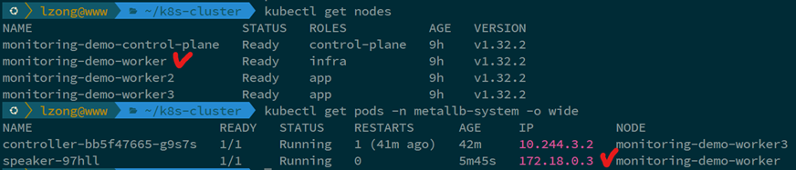
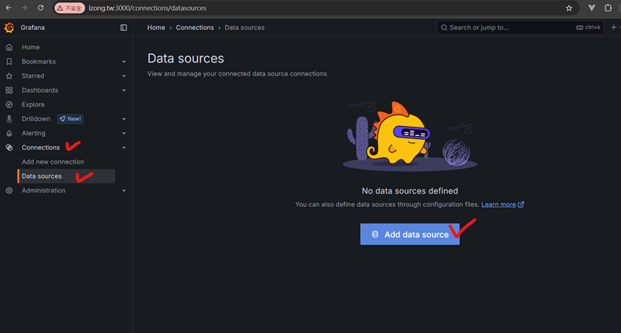

# Kubernetes 監控環境架設指南

## 目錄

1. [架構概述](#架構概述)
2. [步驟 1-2: 建立 Kind 叢集與劃分節點角色](#步驟-1-2-建立-kind-叢集與劃分節點角色)
3. [步驟 3: 安裝 MetalLB](#步驟-3-安裝-metallb)
4. [步驟 4: 安裝監控元件](#步驟-4-安裝監控元件)
5. [步驟 5: 安裝與配置 Grafana](#步驟-5-安裝與配置-grafana)
6. [步驟 6: 部署測試應用程式和 HPA](#步驟-6-部署測試應用程式和-hpa)
7. [儀表板內容說明](#儀表板內容說明)
8. [CPU Throttling 監控說明](#cpu-throttling-監控說明)

## 架構概述

本文說明如何使用 Kind 建立一個包含 1 個 Control Plane 和 3 個 Worker 節點的 Kubernetes 叢集，並基於以下需求進行配置：

- 將 3 個 Worker 節點中的 1 個標記為 Infra 節點，用於執行基礎設施服務
- 將其餘 2 個 Worker 節點標記為 Application 節點，用於執行應用程式
- 在 Infra 節點上安裝 MetalLB (L2模式) 的 Speaker 組件
- 在 Infra 節點上安裝 Prometheus 和 kube-state-metrics
- 在所有節點上安裝 node-exporter
- 在叢集外部使用 Docker 執行 Grafana，並連接到 Prometheus
- 部署測試應用程式到 Application 節點，並設定 HPA

## 架構圖


## 步驟 1-2: 建立 Kind 叢集與劃分節點角色

### 1. 準備 Kind 配置檔

首先，我們需要一個 Kind 的設定檔來定義叢集結構。建立 `kind-config.yaml` 檔案：

```yaml
kind: Cluster
apiVersion: kind.x-k8s.io/v1alpha4
name: monitoring-demo
nodes:
- role: control-plane
  # 為了讓 Prometheus/Grafana 可以抓到 etcd metrics，需要暴露 etcd 的監聽埠
  # 同時，kube-apiserver 也需要啟用 --bind-address=0.0.0.0
  kubeadmConfigPatches:
  - |
    kind: ClusterConfiguration
    apiServer:
      extraArgs:
    etcd:
      local:
        extraArgs:
          "listen-metrics-urls": "http://0.0.0.0:2381" # 監聽所有端口的指標請求
- role: worker
  # 這個 worker 將被標記為 infra node
- role: worker
  # 這個 worker 將被標記為 app node
- role: worker
  # 這個 worker 將被標記為 app node
```

### 2. 建立叢集並標記節點角色

使用以下命令建立叢集：

```bash
$ kind create cluster --config kind-config.yaml
```

識別節點名稱：

```bash
$ kubectl get nodes
```


標記節點角色：

```bash
$ kubectl label node monitoring-demo-worker node-role.kubernetes.io/infra=true
$ kubectl label node monitoring-demo-worker2 node-role.kubernetes.io/app=true
$ kubectl label node monitoring-demo-worker3 node-role.kubernetes.io/app=true
```


## 步驟 3: 安裝 MetalLB

### 1. 安裝 MetalLB

根據 MetalLB 官方文件安裝：

```bash
$ kubectl apply -f https://raw.githubusercontent.com/metallb/metallb/v0.14.9/config/manifests/metallb-native.yaml
```

### 2. 配置 MetalLB (L2 模式)

首先，確定 Kind 叢集的 Docker 網路範圍：

```bash
$ docker ps | grep -i kind
```


使用以下命令確定各 container 的 IP：

```bash
$ docker inspect <container-id> | grep IPAddress
```


選擇一個未被 Kind 節點使用的 IP 範圍，建立 `metallb-l2config.yaml` 檔案：

```yaml
apiVersion: metallb.io/v1beta1
kind: IPAddressPool
metadata:
  name: default-pool
  namespace: metallb-system
spec:
  addresses:
  - 172.18.255.200-172.18.255.250 # 請根據 docker inspect 結果調整此範圍
---
apiVersion: metallb.io/v1beta1
kind: L2Advertisement
metadata:
  name: default
  namespace: metallb-system
spec:
  ipAddressPools:
  - default-pool
```

套用設定：

```bash
$ kubectl apply -f metallb-l2config.yaml
```

### 3. 限制 Speaker 只在 Infra 節點運行

編輯 MetalLB 的 speaker DaemonSet：

```bash
$ kubectl edit daemonset speaker -n metallb-system
```

在 spec.template.spec 下增加 nodeSelector：

```yaml
spec:
  template:
    spec:
      # ... 其他設定 ...
      nodeSelector:
        node-role.kubernetes.io/infra: "true" # << 新增這一行
      tolerations:
      # MetalLB speaker 可能需要容忍 control-plane 的 taint，如果有的話
      - key: "node-role.kubernetes.io/control-plane"
        operator: "Exists"
        effect: "NoSchedule"
      # 也需要容忍我們自己加的 infra taint
      - key: "node-role.kubernetes.io/infra"
        operator: "Exists"
        effect: "NoSchedule"
      # ... 其他設定 ...
```

儲存並退出編輯器。Kubernetes 會自動更新 Pod。
確認 Speaker 只在標記為 infra=true 的節點上運行：

```bash
$ kubectl get pods -n metallb-system -o wide
```

## 步驟 4: 安裝監控元件

### 1.	安裝 Helm:
```bash
$ curl https://raw.githubusercontent.com/helm/helm/main/scripts/get-helm-3 | bash
```
### 2.	新增 Helm Repo:
```bash
$ helm repo add prometheus-community https://prometheus-community.github.io/helm-charts
$ helm repo update
```
### 3.	建立監控 Namespace:
```bash
$ kubectl create namespace monitoring
```
### 4.	使用以下指令取得 Control Plane的IP以備使用
```bash
$ docker ps | grep -i kind #找到 Control Plane 的Container ID
$ docker inspect <container-id> | grep IPAddress #取得IP
```
### 5.	建立 Prometheus設定檔 (prometheus-values.yaml):
```yaml
prometheus:
  prometheusSpec:
    nodeSelector:
      node-role.kubernetes.io/infra: "true"
    serviceMonitorSelector:
      matchLabels:
        release: prometheus
    serviceMonitorNamespaceSelector:
      matchLabels:
        kubernetes.io/metadata.name: monitoring
    resources:
      requests:
        cpu: 200m
        memory: 200Mi
      limits:
        cpu: 1000m
        memory: 256Mi
    retention: 15d
    storageSpec:
      volumeClaimTemplate:
        spec:
          storageClassName: standard
          accessModes: ["ReadWriteOnce"]
          resources:
            requests:
              storage: 1Gi
  service:
    type: NodePort
    nodePort: 30090
    targetPort: 9090
 
kubeStateMetrics:
  nodeSelector:
    node-role.kubernetes.io/infra: "true"
 
nodeExporter:
  tolerations:
  - effect: NoSchedule
    operator: Exists
 
alertmanager:
  enabled: true
  alertmanagerSpec:
    nodeSelector:
      node-role.kubernetes.io/infra: "true"
 
grafana:
  enabled: false
```
### 6.	安裝 Prometheus Stack:
```bash
$ helm install prometheus prometheus-community/kube-prometheus-stack \
  --namespace monitoring \
  -f prometheus-values.yaml
```

## 步驟 5: 安裝與配置 Grafana (外部 Docker/Podman)
### 1.	執行 Grafana 容器:
```bash
$ docker run -d --name=grafana -p 3000:3000 \
  --network=kind \ # 將 Grafana 連接到 kind 網路以便直接訪問 Service IP
  grafana/grafana-oss:latest
```
_注意: --network=kind 是關鍵，它讓 Grafana 容器可以解析並造訪 Kind 叢集內的 Service IP (例如 Prometheus 的 ClusterIP)。如果 Podman 的 kind 網路設置不同，可能需要調整。_
### 2.	造訪 Grafana: 打開瀏覽器訪問 http://localhost:3000 (預設帳號/密碼: admin/admin)。首次登入會要求修改密碼。
### 3.	新增 Prometheus Datasource:
- 點擊左側選單 Connections -> Data Sources -> Add data source。

- 選擇 Prometheus。

- 在 Connection 中輸入http://172.18.0.5:30090，172.18.0.5 為 kind 網路的 Control Plane IP

  - Control Plane IP 取得的方式為: 先執行 docker ps，記錄 control plane 的 container id
  
  - 再使用 docker inspect <container-id> | grep IPAddress 取得 Control Plane 的 IP
  
- 其他設定通常保持預設。
- 點擊 "Save & test"。如果一切正常，會顯示 " Successfully queried the Prometheus API. "。

### 4.	導入儀表板:
-	點擊右上選單的 "+" 圖示 -> Import Dashboard。
-	使用 Grafana.com 上的儀表板 ID： 
  -	Node Exporter Full (節點效能): ID 1860
  -	Kubernetes Cluster Monitoring: ID 3119
  -	Prometheus Stats: ID 2
-	對於每個 ID，在 "Import via grafana.com" 欄位輸入 ID，點擊 Load。
-	選擇你剛剛建立的 Prometheus Datasource。
-	點擊 Import。


### 儀表板內容說明
#### Kubernetes Cluster Monitoring

- Network I/O pressure (網路 I/O 壓力)：監控 Kubernetes 集群在一段時間內的網路輸入和輸出流量。它可以幫助你了解叢集的網路負載情況，例如是否有網路瓶頸、流量尖峰等。觀察趨勢可以幫助你預測潛在的網路問題。
#### Node Exporter Full

- 上方
- Pressure：顯示 CPU、記憶體、IO的壓力百分比。壓力是系統資源不足導致阻塞的時間比例。（https://www.kernel.org/doc/html/latest/accounting/psi.html）
- CPU Busy：目前 CPU的使用率
- SysLoad：通常做為系統平均負載(System Load Average)的替代方案，系統CPU繁忙程度，即有多少行程在等待被CPU調度（行程等待佇列的長度）。
- RAM Used：記憶體使用率
- SWAP Used：Swap使用率
- Root FS Used：根檔案系統使用率，顯示根目錄 ("/") 的磁碟空間使用率百分比 (截圖中顯示 N/A，可能表示無法取得或未設定
- CPU Cores：CPU 核心數
- Uptime：開機時間
- Swap Total：總Swap空間
- 下方
- CPU Basic：CPU各模式（user, system, iowait, idle 等）隨時間變化的使用率
- Memory Basic：記憶隨時間變化的使用率
- Network Traffic Basic：隨時間變化，各個網路介面 (如 eth0) 的接收 (received) 和傳送 (sent) 流量速率變化
- Disk Space Used Basic：隨時間變化，各個掛載點 (mount point) 的磁碟空間使用百分比變化
#### Prometheus Stats

- 從各個 Panel 的名稱可以判斷，提供關於 Prometheus 抓取的樣本數、抓取目標、抓取持續時間以及規則評估等指標。
#### CPU Throttling 監控說明
- 監控 CPU Throttling，需要新增以下面板：
1. 在右上角選擇 + → New Dashboard


2. 選擇 Add visualization


3. 選擇 prometheus


4. 在下方選擇 code，並輸入以下 query
```query
sum(increase(container_cpu_cfs_throttled_periods_total{container!=""}[5m])) by (pod, container, namespace) /
sum(increase(container_cpu_cfs_periods_total{container!=""}[5m])) by (pod, container, namespace) * 100
```

5. 最後選擇 Save dashboard


- 新增這個面板的原因，在於 CPU Throttling 的數值，並不一定會在既有的儀表板中顯示，因此必須手動新增這項指標做為面板
## 步驟 6: 部署測試應用程式和 HPA
test-app.yaml
```yaml
apiVersion: apps/v1
kind: Deployment
metadata:
  name: php-apache
  namespace: default
spec:
  selector:
    matchLabels:
      run: php-apache
  replicas: 1
  template:
    metadata:
      labels:
        run: php-apache
    spec:
      nodeSelector:
        node-role.kubernetes.io/app: "true"
      containers:
      - name: php-apache
        image: k8s.gcr.io/hpa-example
        ports:
        - containerPort: 80
        resources:
          requests:
            cpu: 200m
          limits:
            cpu: 500m
---
apiVersion: v1
kind: Service
metadata:
  name: php-apache
  namespace: default
  labels:
    run: php-apache
spec:
  ports:
  - port: 80
  selector:
    run: php-apache
```
hpa.yaml
```yaml
apiVersion: apps/v1
kind: Deployment
metadata:
  name: php-apache
  namespace: default
spec:
  selector:
    matchLabels:
      run: php-apache
  replicas: 1
  template:
    metadata:
      labels:
        run: php-apache
    spec:
      nodeSelector:
        node-role.kubernetes.io/app: "true"
      containers:
      - name: php-apache
        image: k8s.gcr.io/hpa-example
        ports:
        - containerPort: 80
        resources:
          requests:
            cpu: 200m
          limits:
            cpu: 500m
---
apiVersion: v1
kind: Service
metadata:
  name: php-apache
  namespace: default
  labels:
    run: php-apache
spec:
  ports:
  - port: 80
  selector:
    run: php-apache
```
套用設定檔:
```bash
$ kubectl apply -f test-app.yaml
$ kubectl apply -f hpa.yaml
```